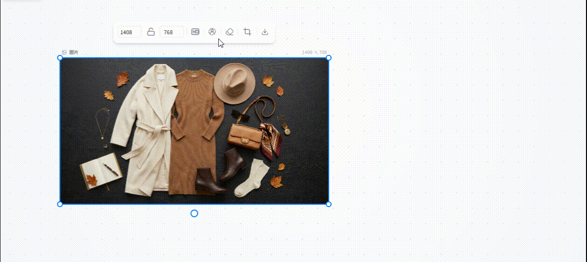
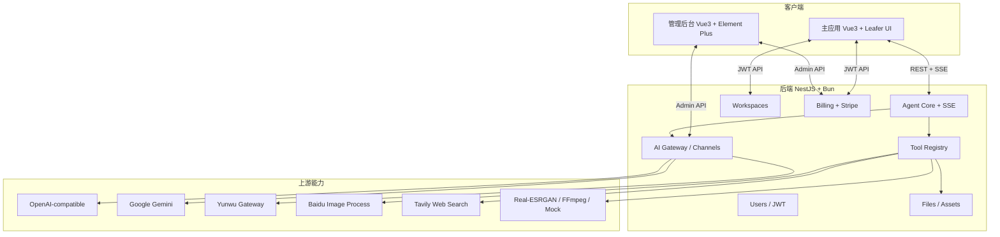

<div align="center">

# 🎨 OmniCanvas

### AI 原生无限画布 · 多模态空间创作引擎

**The AI-Native Infinite Canvas for Multimodal Spatial Creation**

用自然语言驱动矢量画布：Agent 理解画布状态，调用工具完成布局、生图、修图与设计规划。

[](https://opensource.org/licenses/MIT)
[](https://vuejs.org/)
[](https://www.typescriptlang.org/)
[](https://www.leaferjs.com/)
[](https://nestjs.com/)
[](https://bun.sh/)
[](CONTRIBUTING.md)

[功能特性](#-功能特性) · [技术架构](#-技术架构) · [快速开始](#-快速开始) · [管理后台](#-管理后台-admin) · [Agent 工具](#-agent-工具矩阵) · [计费系统](#-计费系统)

<br />


<br />


</div>

---

## 💡 项目简介

OmniCanvas 是一个 **AI 驱动的无限矢量画布**。创作者可以像使用 Figma / 白板一样手动画图，也可以通过对话让 Agent 读取画布 JSON 状态、规划步骤并调用工具，在画布上直接完成生成、布局与修图。

| 模块 | 说明 |
| ---- | ---- |
| **主应用** (`/`) | Vue 3 + Leafer UI 无限画布、Agent 面板、工作区与素材库 |
| **后端** (`server/`) | NestJS + Bun：Agent SSE、多模态网关、工作区、用户与计费 |
| **管理后台** (`admin/`) | Vue 3 + Element Plus：渠道、模型、用户、计费与诊断 |

---

## ✨ 功能特性

### 1. 高性能矢量无限画布

- **Leafer UI 2.x**：无级缩放、平移、吸附对齐（`leafer-x-easy-snap`）、GPU 友好渲染
- **基础工具**：选择 / 抓手 / Frame / 文本 / 马克笔 / 形状（矩形、椭圆、多边形、星形、直线）/ 上传
- **富文本与公式**：TipTap 富文本、KaTeX 数学公式
- **图层与容器**：图层面板、Frame 画板、成组 / 解组、锁定 / 隐藏、拖拽重排
- **历史与背景**：Undo / Redo 快照；网格 / 点阵背景，暗色主题下支持鼠标跟随泛光点阵
- **浮动属性栏**：填充、描边、圆角、字号字体、宽高锁定、自动布局与对齐、导出下载
- **缩略图与缩放**：Minimap、缩放控制器

### 2. 多模态生成与图像处理

- **图片 / 视频生成节点**：工具栏内置图片生成器与视频生成器，支持模型选择与参数配置
- **多上游模型**：OpenAI 兼容网关、Google Gemini、云雾等第三方渠道；可在管理后台动态配置
- **智能修图**（可在浮动工具栏或由 Agent 调用）  
  - 去背景 `remove_background`  
  - 局部重绘 / 擦除 `inpaint_image`  
  - 指令编辑 `edit_image`  
  - 超分放大 `upscale_image`（百度图像处理 或 本地 Real-ESRGAN）
- **素材库**：私有素材管理（文件夹、筛选、排序、拖入画布防碰撞放置）

### 3. AI Agent（SSE 流式 + Tool Calling）

- **画布状态感知**：实时序列化画布节点，供 Agent 查询与修改
- **SSE 流式协议**：思考过程、工具调用、画布操作、用量与最终回复实时推送
- **MCOT 可视化**：多步决策 / 思维链在前端以图卡形式展示
- **方案选项卡**：多设计变体预览与一键应用
- **参考图飞入**：`Ctrl + 鼠标左键` 将画布元素以抛物线动画送入 Agent 输入区作为参考
- **电商套图能力**：针对 Amazon / 淘宝 / 京东等平台的主图与详情页套图规划与生成策略
- **离线 Mock**：`MOCK_AGENT` / `MOCK_IMAGE_GENERATION` / `MOCK_VIDEO` 支持无 Key 本地联调

### 4. 工作区、账户与计费

- **多工作区**：创建 / 重命名 / 删除 / 搜索；画布状态按项目持久化
- **用户体系**：用户名密码登录 + 可选 Google OAuth；JWT 鉴权
- **积分计费**：注册赠送、预扣冻结、成功确认 / 失败释放、幂等键防重扣
- **支付**：Stripe Checkout 托管支付（Webhook 到账）；也可配置通用托管收银台模板
- **侧栏余额**：实时积分展示，余额不足自动引导充值

### 5. 管理后台

独立 Admin（默认开发端口 `5174`），包含：

| 模块 | 能力 |
| ---- | ---- |
| 系统概览 | 服务与配置概览 |
| 上游渠道 | OpenAI / Gemini / 自定义网关路由 |
| 模型目录 | Chat / Image / Video 默认模型映射 |
| 用户管理 | 用户列表与管理 |
| 计费与支付 | 账户、订单、商品目录、定价规则、调账 |
| Token 统计 | 用量统计 |
| Agent 配置 | 提示词与相关 Agent 参数 |
| 接口诊断 | 渠道连通性与延迟测试 |

---

## 🏗️ 技术架构



### 技术栈

| 领域 | 技术 |
| ---- | ---- |
| 画布引擎 | Leafer UI 2.x、`@leafer-in/*`、`leafer-x-easy-snap` |
| 前端 | Vue 3.5、TypeScript、Vite 5、Vue Router、PrimeVue 4、UnoCSS、GSAP |
| 富文本 | TipTap 3、KaTeX、Marked |
| 后端 | NestJS 11、Bun、Express、RxJS、SQLite |
| AI | Vercel AI SDK、`@ai-sdk/openai`、`@google/genai`、OpenAI SDK |
| 媒体 | FFmpeg、Multer、Real-ESRGAN（本地可选） |
| 支付 | Stripe Checkout + Webhook |
| 管理端 | Vue 3、Element Plus、Vite |

---

## 📁 仓库结构

```text
omnicanvas/
├── src/                          # 主前端（画布 + Agent UI）
│   ├── components/
│   │   ├── Canvas.vue            # 无限画布与事件层
│   │   ├── AgentPanel.vue        # Agent 对话面板
│   │   ├── ViboardToolbar.vue    # 主工具栏
│   │   ├── sidebar.vue           # 工作区 / 用户 / 计费入口
│   │   ├── agent/                # 消息流、工具卡片、方案预览
│   │   ├── canvas/               # 图层、背景、浮动工具栏、生成节点
│   │   ├── auth/                 # 登录与用户资料
│   │   └── billing/              # 充值与账单对话框
│   ├── composables/              # useCanvas / useAgent / useBilling / useUser …
│   ├── views/                    # BoardView、LoginView
│   └── utils/                    # API 与画布工具函数
├── server/                       # NestJS 后端
│   ├── src/
│   │   ├── agent/                # Agent 循环、协议、工具、电商策略
│   │   ├── ai/                   # 多模态生成与渠道解析
│   │   ├── billing/              # 积分、订单、Stripe
│   │   ├── channels/             # 上游渠道
│   │   ├── model-config/         # 模型目录
│   │   ├── workspaces/           # 工作区持久化
│   │   ├── users/                # 用户与鉴权相关
│   │   └── files/                # 上传、素材、百度修图客户端
│   ├── realesrgan/               # 本地超分二进制（可选）
│   ├── docker-compose.yml
│   └── deploy-docker.{sh,ps1}
├── admin/                        # 管理后台
├── agent-integration/            # Agent 集成说明与示例
├── run-all.js                    # 一键启动前/后/Admin
└── package.json
```

---

## 🚀 快速开始

### 环境要求

- **Node.js** ≥ 18
- **Bun** ≥ 1.0（后端推荐；也可用 npm 安装依赖，但服务端脚本面向 Bun）

### 安装

```bash
# 克隆仓库
git clone https://github.com/ye971829766/OmniCanvas.git
cd OmniCanvas

# 主应用
npm install

# 后端
cd server && bun install && cd ..

# 管理后台
cd admin && npm install && cd ..
```

### 环境变量

```bash
cp .env.example .env
cd server && cp .env.example .env && cd ..
```

#### 前端 `.env`

```env
VITE_API_BASE_URL=http://localhost:3000
VITE_APP_TITLE=OmniCanvas
VITE_ENABLE_IMAGE_GEN=true
VITE_ENABLE_VIDEO_GEN=true

# 可选：Google 登录
# VITE_GOOGLE_CLIENT_ID=xxx.apps.googleusercontent.com
```

#### 后端 `server/.env`（常用项）

```env
PORT=3000
CORS_ORIGIN=http://localhost:5173
JWT_SECRET=replace-with-at-least-32-random-bytes

# OpenAI 兼容渠道（必填，除非全开 Mock）
OPENAI_API_KEY=sk-your_key
OPENAI_BASE_URL=https://api.openai.com/v1

# 可选：Gemini / 云雾 / 图床 / Unsplash / Tavily / 百度修图
# GOOGLE_API_KEY=
# YUNWU_API_KEY=
# TAVILY_API_KEY=
# BAIDU_API_KEY=
# BAIDU_SECRET_KEY=
# UPSCALE_PROVIDER=baidu   # 或 local

# 计费
BILLING_SIGNUP_CREDITS=100
# STRIPE_SECRET_KEY=
# STRIPE_PUBLISHABLE_KEY=
# STRIPE_WEBHOOK_SECRET=
# FRONTEND_URL=http://localhost:5173

# 离线开发
MOCK_AGENT=false
MOCK_IMAGE_GENERATION=false
MOCK_VIDEO=false

# 可选：Google OAuth
# GOOGLE_CLIENT_ID=
# GOOGLE_CLIENT_SECRET=
```

更完整的变量说明见 `server/.env.example`。

### Google 登录（可选）

1. 在 [Google Cloud Console](https://console.cloud.google.com/apis/credentials) 创建 **Web 应用** OAuth 客户端
2. 将 `http://localhost:5173`（或生产域名）加入 **已授权的 JavaScript 来源**
3. 前端设置 `VITE_GOOGLE_CLIENT_ID`，后端设置 `GOOGLE_CLIENT_ID`（及可选 `GOOGLE_CLIENT_SECRET`）

---

## ⚡ 运行方式

### 方式 A：本地一键启动（开发推荐）

```bash
npm run dev:all
# 或
bun dev:all
```

将同时启动：

| 服务 | 地址 | 说明 |
| ---- | ---- | ---- |
| 主应用 | http://localhost:5173 | 画布 + Agent |
| 管理后台 | http://localhost:5174 | OmniAdmin |
| 后端 API | http://localhost:3000 | REST + Agent SSE |

### 方式 B：分终端启动

```bash
# 终端 1：后端
cd server && bun run dev

# 终端 2：主应用
npm run dev

# 终端 3：管理后台
cd admin && npm run dev
```

### 方式 C：Docker（后端）

后端 Docker 配置位于 `server/`：

```bash
cd server

# Linux / macOS
chmod +x deploy-docker.sh && ./deploy-docker.sh

# Windows PowerShell
.\deploy-docker.ps1

# 或
docker compose up -d --build
```

根目录也提供 `npm run docker:deploy`（需本机 Docker Compose 与对应编排文件就绪）。

### 测试

```bash
# 前端
npm test

# 后端
cd server && bun test
```

---

## 🛠️ 管理后台 Admin

开发环境：http://localhost:5174

主要能力：

1. **上游渠道**：配置 API Base URL、密钥与用途分流（Chat / Image / Video）
2. **模型目录**：绑定默认对话、生图、生视频模型
3. **用户与计费**：用户管理、积分账户、订单、定价版本与审计调账
4. **Agent 配置**：调整 Agent 相关预设
5. **接口诊断**：实测渠道连通性与响应

---

## 🧰 Agent 工具矩阵

工具实现位于 `server/src/agent/tools/`，由 `tool.registry.ts` 统一注册。当前主要包括：

| 类别 | 工具 |
| ---- | ---- |
| **画布结构** | `set_frame` · `add_frame` · `add_group` · `add_text` · `add_rect` · `add_image` |
| **节点操作** | `update_node` · `remove_node` · `query_canvas` · `focus_node` · `export_node_image` |
| **布局** | `auto_layout` · `align_nodes` · `distribute_nodes` |
| **生成** | `generate_image` · `generate_video` |
| **图像处理** | `edit_image` · `remove_background` · `inpaint_image` · `upscale_image` |
| **风格与灵感** | `set_brand` · `apply_palette` · `collect_inspiration` |
| **规划与质检** | `plan_design` · `review_and_adjust` · `analyze_design` · `verify_design` |
| **联网** | `web_search` · `web_extract`（需 `TAVILY_API_KEY`） |

协议与集成细节见 [`agent-integration/AGENT-README.md`](agent-integration/AGENT-README.md)。

前端侧栏 / 工具栏快捷键示例：

| 操作 | 快捷键 |
| ---- | ------ |
| 选择 / 抓手 / Frame / 文本 / 笔 / 形状 | `V` · `P` · `F` · `T` · `M` · `K` |
| 图片生成 / 视频生成 / 上传 | `I` · `O` · `L` |
| 引用到 Agent | `Ctrl` + 鼠标左键（画布元素） |

---

## 💳 计费系统

已落地能力概览（详见 [`BILLING_SYSTEM_DESIGN.md`](BILLING_SYSTEM_DESIGN.md)）：

- **微积分账本**：`1 credit = 1_000_000 micros`，账户投影 + 不可变流水
- **预扣 → 确认 / 释放**：Agent LLM 与生图 / 生视频 / 修图等在成功终态确认扣费
- **幂等**：`Idempotency-Key + userId + requestHash` 防止重试重复扣费
- **用户 API**：余额、商品目录、流水、报价、下单与 Checkout
- **管理 API**：总览、账户、订单、定价规则、可审计调账
- **Stripe**：配置密钥与 Webhook 后启用托管支付；支付到账只信任 Webhook

注册赠送积分由 `BILLING_SIGNUP_CREDITS` 控制（默认 100）。

---

## 🗺️ 路线图（规划）

以下为产品方向，**未勾选项表示尚未作为已交付能力写入当前版本**：

- [x] 单 Agent + 多工具 Tool Calling 与 SSE 流式执行
- [x] 多模态生图 / 生视频与画布内修图管线
- [x] 工作区、用户鉴权与积分计费
- [x] 管理后台渠道 / 模型 / 用户 / 计费
- [ ] 多用户实时协同编辑（WebSocket / WebRTC）
- [ ] 多 Agent 协作编排（设计 / 审查 / 布局分工）
- [ ] 画布 ↔ 生产代码双向导出（Vue / React / Tailwind）
- [ ] 开放插件与自定义 Agent 工具 SDK

---

## 🤝 贡献

欢迎提交 Issue 与 PR。

1. Fork 本仓库  
2. 创建分支：`git checkout -b feature/your-feature`  
3. 提交更改并推送  
4. 发起 Pull Request  

详细约定见 [CONTRIBUTING.md](CONTRIBUTING.md)。

---

## 📄 License

[MIT License](LICENSE)

---

## ☕ 捐赠与联系

如果项目对你有帮助，欢迎请作者喝杯咖啡，或通过微信交流。

<div align="center">
  <table>
    <tr>
      <td align="center"><b>微信赞赏</b></td>
      <td align="center"><b>支付宝赞赏</b></td>
      <td align="center"><b>联系作者微信</b></td>
    </tr>
    <tr>
      <td align="center"></td>
      <td align="center"></td>
      <td align="center"></td>
    </tr>
  </table>
</div>

---

<div align="center">
  <sub>Built with ❤️ by the OmniCanvas community.</sub>
</div>
