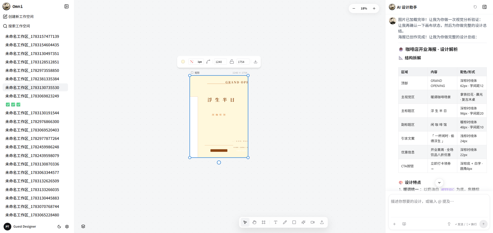
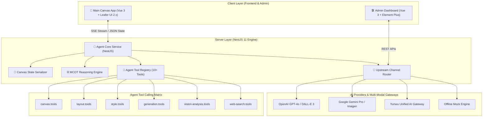

<div align="center">

# 🎨 OmniCanvas

### **The Next-Generation AI-Native Infinite Canvas for Multimodal Spatial Creation**

_Redefining visual design and creative workflows by fusing high-performance vector graphics, autonomous multi-agent reasoning networks, and multimodal generative AI._

基于自主多模态 AI Agent 驱动的下一代空间化矢量无限画布与智能设计创作引擎。

[](https://opensource.org/licenses/MIT)
[](https://vuejs.org/)
[](https://www.typescriptlang.org/)
[](https://www.leaferjs.com/)
[](https://nestjs.com/)
[](https://bun.sh/)
[](CONTRIBUTING.md)

[English](#-key-features) · [中文特性](#-中文核心特性) · [Architecture](#-system-architecture) · [Getting Started](#-getting-started) · [Admin System](#-admin-dashboard--management) · [Vision & Roadmap](#-vision--future-roadmap)

<br />



</div>

---

## 💡 Vision & Mission / 愿景与使命

Traditional whiteboards and vector editing tools are bounded by manual interaction overhead. **OmniCanvas** transforms the infinite canvas from a static design dynamic canvas into an **Active Cognitive Space**.

By deeply combining real-time spatial state parsing with LLM reasoning, visual analysis models, and multi-modal generative AI, OmniCanvas empowers creators to articulate concepts in natural language, while autonomous agents turn high-level intent into pixel-perfect vector structures, styled layouts, and generative media.

> **"From canvas as a canvas, to canvas as an autonomous co-creator."**

---

## 🔥 Key Features

### 🎨 1. High-Performance Vector Infinite Canvas Engine

- **Leafer UI 2.x Engine Integration**: Ultra-fast vector rendering with unlimited zoom, smooth pan, GPU hardware acceleration, and sub-millisecond response.
- **Rich Vector Primitive Suite**: Rectangles, circles, ellipses, stars, regular polygons, straight lines, directional arrows, and dynamic connectors.
- **Natural Freehand & Marker Stroke**: Smooth marker pen drawing with customizable stroke thickness, pressure sensitivity, and live smoothing.
- **TipTap Rich Text & KaTeX Math**: Seamless integration of TipTap markdown rich text editing alongside LaTeX/KaTeX mathematical formula rendering.
- **Smart Image Manipulation & Crop**: Non-destructive image insertion, precise dynamic cropping (`useCanvasCrop`), aspect-ratio lock, and mask controls.
- **Containers & Framing (Frame)**: Nested frame artboards supporting grouping, boundary snapping (`leafer-x-easy-snap`), and spatial region management.
- **Non-Destructive History & Background**: Full undo/redo stack snapshot management, coupled with customizable grid, dot matrix, and infinite viewport backgrounds.

### 🤖 2. Autonomous Multi-Modal AI Agent & MCOT Reasoning Network

- **Real-Time Spatial Context Awareness**: The Agent continuously reads, serializes, and understands the precise JSON state of all canvas elements in real time.
- **MCOT (Multi-Chain of Thought) Visual Reasoning**: Displays the Agent's multi-step decision graph and internal thought tree in an interactive visual flow.
- **SSE Stream Protocol & Live Execution**: Zero-latency Server-Sent Events streaming response with live feedback on tool calling steps.
- **Interactive Option Preview Cards**: The Agent automatically generates multiple design variants, enabling creators to preview and switch options with a single click.

### 🧰 3. Industrial-Grade Agent Tool Calling Matrix

OmniCanvas provides a modular, pluggable 10+ tool registry (`server/src/agent/tools/`):

- 📐 `canvas.tools`: Full CRUD operations over canvas elements, layering, grouping, and styling.
- 🎨 `style.tools`: Automated color palette extraction, gradient synthesis, and visual style transfer.
- 📐 `layout.tools`: Algorithmic alignment, dynamic grid auto-layout, spacing distribution, and smart arrangement.
- 💡 `plan-design.tools`: Step-by-step design breakdown, UI layout planning, and multi-option generator.
- 👁️ `vision-analysis.tools`: LLM Vision-assisted aesthetic evaluation, visual hierarchy checking, and design compliance verification.
- 🔍 `web-search.tools` & `inspiration.tools`: Real-time web inspiration fetching, color moodboard curation, and reference search.

### 🖼️ 4. Native Multi-Modal Generation Pipeline

- **AI Image Generation**: Direct integration with Flux, OpenAI DALL-E 3, and Google Gemini Imagen with progress streaming and instant canvas placement.
- **AI Video Generation**: Native support for Luma, CogVideo, and local FFmpeg video rendering pipelines.

### 🛠️ 5. Enterprise Admin & Dynamic Gateway Management

- **Dedicated Admin Portal (`/admin`)**: Vue 3 + Element Plus dashboard for managing system metrics, channels, models, and diagnostic tools.
- **Dynamic AI Model Catalog**: Flexible assignment of Chat, Image, and Video models per workspace or user request.
- **Hybrid Offline Mock Engine**: Complete local mock modes (`MOCK_AGENT`, `MOCK_IMAGE_GENERATION`, `MOCK_VIDEO`) allowing full feature development without API keys.

---

## 🌟 中文核心特性

- 🎨 **超高性能矢量无限画布**：底层基于 Leafer UI 2.x 极速渲染引擎构建，支持无级缩放、GPU 硬件加速、丰富矢量图形（矩形/星形/多边形/箭头/连线）、Mark 画笔标注、TipTap 富文本与 KaTeX 数学公式渲染。
- 🤖 **自主多模态 AI Agent 与 MCOT 思维链图谱**：具备实时空间状态感知能力，可将画布 JSON 结构即时解析入上下文；内置 Multi-Chain of Thought (MCOT) 可视化思维链图谱与 SSE 低延迟流式响应。
- 🧰 **工业级 10+ Tool Calling 工具矩阵**：涵盖矢量控制、智能对齐布局（Grid/Flex/Flow）、自动调色板生成、UI 设计方案规划、基于视觉模型的图像审查（Vision Analysis）及联网灵感搜索。
- 🖼️ **原生多模态生成流水线**：无缝打通 Flux / DALL-E 3 / Gemini 图像生成与 Luma / CogVideo 视频生成，生成结果实时直通画布图层。
- 🎛️ **交互式设计方案选项卡 (Option Preview Cards)**：Agent 自动推演多套设计变体并渲染选型卡片，用户在聊天面板中一键实时预览并一键应用至画布。
- 📐 **专业图层与画板框架管理 (Layer & Frame)**：支持树状图层面板、拖拽重排、锁定/隐藏、成组/解组、容器画板 (Frame) 及点阵/网格背景自定义。
- 🛠️ **专属 Admin 企业级管理后台**：内置独立控制台（Vue 3 + Element Plus），提供系统监控、多上游渠道管理、模型目录配置及 API 连通性诊断测试。
- 🔌 **全能 AI 网关与混合脱机开发引擎**：原生支持 OpenAI、Google Gemini、Anthropic 及第三方网关（云雾 Yunwu API），支持全套脱机 Mock 仿真调试。

---

## 🏗️ System Architecture



---

## 💻 Tech Stack Matrix

| Area                  | Technologies & Frameworks                                                       | Description                                                  |
| --------------------- | ------------------------------------------------------------------------------- | ------------------------------------------------------------ |
| **Canvas Engine**     | Leafer UI 2.x, `@leafer-in/editor`, `@leafer-in/viewport`, `leafer-x-easy-snap` | High-performance vector graphics rendering engine            |
| **Frontend Core**     | Vue 3.5 (Composition API), TypeScript 5.x, Vite 5, Vue Router 4                 | Main user application architecture                           |
| **UI Components**     | PrimeVue 4, Lucide Icons, PrimeIcons, Element Plus (Admin)                      | Component libraries for App & Admin                          |
| **Rich Text & Math**  | TipTap 3, KaTeX, Marked, Incremark                                              | Canvas text formatting and mathematical expression rendering |
| **Styling & Animate** | UnoCSS, GSAP Animation Engine, Sass                                             | Atomic CSS utility styling and smooth transitions            |
| **Server Framework**  | NestJS 11, Express, Bun Runtime, RxJS                                           | Enterprise backend web framework and fast execution          |
| **AI Integration**    | Vercel AI SDK (`ai`, `@ai-sdk/openai`), `@google/genai`                         | Multi-provider unified LLM & multi-modal orchestration       |
| **Media Engine**      | FFmpeg Installer, Multer File Manager                                           | Server-side video processing and file upload pipeline        |

---

## 🚀 Getting Started

### 1. Prerequisites

- **Node.js** >= 18
- **Bun** >= 1.0 (Recommended for high performance) or `npm`/`pnpm`

### 2. Installation

```bash
# Clone the repository
git clone https://github.com/ye971829766/OmniCanvas.git
cd OmniCanvas

# Install root & frontend dependencies
npm install

# Install backend dependencies
cd server
bun install
cd ..

# Install admin dependencies
cd admin
npm install
cd ..
```

### 3. Environment Setup

Create `.env` files for both frontend and backend:

```bash
# Frontend
cp .env.example .env

# Backend
cd server
cp .env.example .env
cd ..
```

#### Frontend Environment (`.env`)

```env
VITE_API_BASE_URL=http://localhost:3000
VITE_APP_TITLE=OmniCanvas
VITE_ENABLE_IMAGE_GEN=true
VITE_ENABLE_VIDEO_GEN=true
```

#### Backend Environment (`server/.env`)

```env
PORT=3000
OPENAI_API_KEY=your_openai_key_here
OPENAI_BASE_URL=https://api.openai.com/v1
GOOGLE_API_KEY=your_gemini_key_here

# Offline Development Mocks (Set true to test without API credits)
MOCK_AGENT=false
MOCK_IMAGE_GENERATION=false
MOCK_VIDEO=false
```

---

## ⚡ Running the Application

### Option A: One-Click Startup (Recommended)

Start Frontend, Backend, and Admin Dashboard concurrently with a single unified command:

```bash
bun dev:all
# or
npm run dev:all
```

| Service             | Local URL               | Description                                  |
| ------------------- | ----------------------- | -------------------------------------------- |
| **Frontend App**    | `http://localhost:5173` | Main infinite canvas & AI agent interface    |
| **Admin Dashboard** | `http://localhost:5174` | System monitoring, channels, and diagnostics |
| **Backend Service** | `http://localhost:3000` | NestJS REST & SSE Agent service              |

### Option B: Individual Service Startup

```bash
# Terminal 1: Backend
cd server && bun run dev

# Terminal 2: Main Frontend App
npm run dev

# Terminal 3: Admin Dashboard
cd admin && npm run dev
```

---

## 🛠️ Admin Dashboard & Management

OmniCanvas contains a dedicated enterprise administration suite in `./admin`:

1. **System Dashboard (概览)**: Monitor active sessions, service uptime, and model configuration quotas.
2. **Upstream Channels (上游渠道)**: Configure OpenAI API, Google Gemini, and custom gateway routes with failover priority.
3. **Model Catalog (模型目录)**: Set default model mappings for Chat (e.g., GPT-4o), Image (e.g., Flux/DALL-E 3), and Video (e.g., Luma).
4. **Agent Presets (Agent 配置)**: Adjust system prompts, temperature, and fine-tune available tool definitions.
5. **API Diagnostics (接口诊断)**: Test real-time connection status, latency, and response payloads across all registered API channels.

---

## 📁 Deep Repository Architecture

```
omnicanvas/
├── src/                        # Main Frontend Application
│   ├── components/             # UI Components
│   │   ├── Canvas.vue          # Main infinite canvas container & event layer
│   │   ├── AgentPanel.vue      # AI Agent streaming interaction panel
│   │   ├── ViboardToolbar.vue  # Main floating drawing tool palette
│   │   ├── sidebar.vue         # Workspace sidebar & navigation manager
│   │   ├── agent/              # MCOT graph, tool cards, option preview cards
│   │   ├── canvas/             # Layer panel, zoom controller, grid background
│   │   └── toolbar/            # Stroke slider, color picker, text controls
│   ├── composables/            # Vue Composition Hooks
│   │   ├── useCanvas.ts        # Core element management & Leafer UI bindings
│   │   ├── useAgent.ts         # Agent SSE streaming & execution dispatcher
│   │   ├── useCanvasCrop.ts    # Interactive image cropping hook
│   │   ├── useCanvasHistory.ts # State snapshots & Undo/Redo pipeline
│   │   └── useCanvasFrame.ts   # Artboard containers & Frame management
│   ├── types/                  # Shared TypeScript data models
│   └── views/                  # Application views
├── server/                     # Backend NestJS Engine
│   └── src/
│       ├── agent/              # Autonomous Agent Core
│       │   ├── agent.service.ts    # ReAct agent execution loop & tool runner
│       │   ├── canvas-state.ts     # Canvas JSON state parser & serializer
│       │   ├── mcot-graph.ts       # MCOT reasoning graph generator
│       │   ├── system-prompt.ts    # Domain-aware prompt templates
│       │   └── tools/              # 10+ Tool Calling implementations
│       ├── ai/                 # Multi-provider LLM, Image & Video adapters
│       ├── workspaces/         # Workspace persistence & session management
│       ├── channels/           # Gateway channel router & failover manager
│       └── model-config/       # Dynamic model directory service
├── admin/                      # Vue 3 + Element Plus Admin Dashboard
├── run-all.js                  # Cross-platform concurrent task orchestrator
└── agent-integration/          # Integration specs & developer guides
```

---

## 🗺️ Vision & Future Roadmap (2026 - 2027)

OmniCanvas is advancing towards a comprehensive spatial AI ecosystem. Our strategic roadmap includes:

```
┌─────────────────────────────────────────────────────────────────────────────┐
│                            OMNICANVAS ROADMAP                               │
└─────────────────────────────────────────────────────────────────────────────┘
  Phase 1 (Q3 2026)      Phase 2 (Q4 2026)      Phase 3 (Q1 2027)      Phase 4 (Q2 2027)
  Multi-Agent Network  ──► Code-to-Canvas UI ──► Spatial 3D & Vector ──► Open Plugin Ecosystem
```

- [x] **Phase 1: Real-time Multi-Agent Collaborative Network**
  - Multi-agent orchestration (e.g. Design Agent + Critic Agent + Layout Specialist Agent working concurrently on one canvas).
  - WebSockets / WebRTC real-time multi-user & multi-agent collaborative editing.
- [ ] **Phase 2: Bidirectional Code-to-Canvas & UI Component Export**
  - One-click transformation of canvas vector components into Vue 3 / React / Tailwind CSS production code.
  - Live preview of running frontend components directly embedded in canvas artboards.
- [ ] **Phase 3: Spatial 3D & Generative Vector Intelligence**
  - Integration of 3D Gaussian Splatting & WebGL 3D canvas viewports alongside Leafer 2D vector elements.
  - Fine-tuned local Diffusion Models for native SVG vector icon and illustration generation.
- [ ] **Phase 4: Autonomous Design Workflow Plugin Ecosystem**
  - Open-source SDK for third-party developers to register custom Agent tools, canvas nodes, and AI workflows.
  - Marketplace for sharing Agent prompts, design knowledge bases, and custom UI components.

---

## 🤝 Contributing

We welcome contributions from developers, designers, and AI enthusiasts around the globe!

1. Fork the Repository
2. Create your Feature Branch (`git checkout -b feature/AmazingFeature`)
3. Commit your Changes (`git commit -m 'Add some AmazingFeature'`)
4. Push to the Branch (`git push origin feature/AmazingFeature`)
5. Open a Pull Request

Please refer to our [Contributing Guide](CONTRIBUTING.md) for detailed guidelines.

---

## 📄 License

Distributed under the **MIT License**. See [`LICENSE`](LICENSE) for more information.

---

<div align="center">
  <sub>Built with ❤️ by the OmniCanvas Open Source Team & Community.</sub>
</div>            # Vue Composition Hooks
│   │   ├── useCanvas.ts        # Core element management & Leafer UI bindings
│   │   ├── useAgent.ts         # Agent SSE streaming & execution dispatcher
│   │   ├── useCanvasCrop.ts    # Interactive image cropping hook
│   │   ├── useCanvasHistory.ts # State snapshots & Undo/Redo pipeline
│   │   └── useCanvasFrame.ts   # Artboard containers & Frame management
│   ├── types/                  # Shared TypeScript data models
│   └── views/                  # Application views
├── server/                     # Backend NestJS Engine
│   └── src/
│       ├── agent/              # Autonomous Agent Core
│       │   ├── agent.service.ts    # ReAct agent execution loop & tool runner
│       │   ├── canvas-state.ts     # Canvas JSON state parser & serializer
│       │   ├── mcot-graph.ts       # MCOT reasoning graph generator
│       │   ├── system-prompt.ts    # Domain-aware prompt templates
│       │   └── tools/              # 10+ Tool Calling implementations
│       ├── ai/                 # Multi-provider LLM, Image & Video adapters
│       ├── workspaces/         # Workspace persistence & session management
│       ├── channels/           # Gateway channel router & failover manager
│       └── model-config/       # Dynamic model directory service
├── admin/                      # Vue 3 + Element Plus Admin Dashboard
├── run-all.js                  # Cross-platform concurrent task orchestrator
└── agent-integration/          # Integration specs & developer guides
```

---

## 🗺️ Vision & Future Roadmap (2026 - 2027)

OmniCanvas is advancing towards a comprehensive spatial AI ecosystem. Our strategic roadmap includes:

```
┌─────────────────────────────────────────────────────────────────────────────┐
│                            AGENTBOARD ROADMAP                               │
└─────────────────────────────────────────────────────────────────────────────┘
  Phase 1 (Q3 2026)      Phase 2 (Q4 2026)      Phase 3 (Q1 2027)      Phase 4 (Q2 2027)
  Multi-Agent Network  ──► Code-to-Canvas UI ──► Spatial 3D & Vector ──► Open Plugin Ecosystem
```

- [x] **Phase 1: Real-time Multi-Agent Collaborative Network**
  - Multi-agent orchestration (e.g. Design Agent + Critic Agent + Layout Specialist Agent working concurrently on one canvas).
  - WebSockets / WebRTC real-time multi-user & multi-agent collaborative editing.
- [ ] **Phase 2: Bidirectional Code-to-Canvas & UI Component Export**
  - One-click transformation of canvas vector components into Vue 3 / React / Tailwind CSS production code.
  - Live preview of running frontend components directly embedded in canvas artboards.
- [ ] **Phase 3: Spatial 3D & Generative Vector Intelligence**
  - Integration of 3D Gaussian Splatting & WebGL 3D canvas viewports alongside Leafer 2D vector elements.
  - Fine-tuned local Diffusion Models for native SVG vector icon and illustration generation.
- [ ] **Phase 4: Autonomous Design Workflow Plugin Ecosystem**
  - Open-source SDK for third-party developers to register custom Agent tools, canvas nodes, and AI workflows.
  - Marketplace for sharing Agent prompts, design knowledge bases, and custom UI components.

---

## 🤝 Contributing

We welcome contributions from developers, designers, and AI enthusiasts around the globe!

1. Fork the Repository
2. Create your Feature Branch (`git checkout -b feature/AmazingFeature`)
3. Commit your Changes (`git commit -m 'Add some AmazingFeature'`)
4. Push to the Branch (`git push origin feature/AmazingFeature`)
5. Open a Pull Request

Please refer to our [Contributing Guide](CONTRIBUTING.md) for detailed guidelines.

---

## 📄 License

Distributed under the **MIT License**. See [`LICENSE`](LICENSE) for more information.

---

<div align="center">
  <sub>Built with ❤️ by the OmniCanvas Open Source Team & Community.</sub>
</div>
