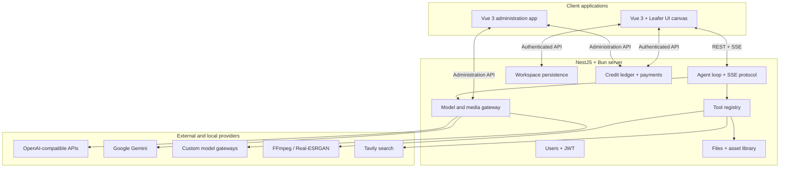

<div align="center">

# OmniCanvas

### An AI-native infinite canvas for spatial, multimodal creation

Turn natural-language intent into inspectable canvas operations. OmniCanvas lets an agent understand structured canvas state, plan a design, call tools, and create or edit visual content directly on an infinite vector canvas.

[简体中文](README.zh-CN.md) · [Features](#features) · [Architecture](#architecture) · [Quick start](#quick-start) · [Contributing](#contributing)

[](LICENSE)
[](https://github.com/ye971829766/OmniCanvas/stargazers)
[](https://github.com/ye971829766/OmniCanvas/forks)
[](https://github.com/ye971829766/OmniCanvas/commits/master)
[](https://vuejs.org/)
[](https://www.typescriptlang.org/)

<br />


<br />


</div>

---

## Why OmniCanvas?

Most AI creative tools hide the model behind a prompt box and return a flattened result. OmniCanvas explores a different, open approach: the canvas remains a structured workspace that both people and agents can inspect and modify.

This repository is intended to be useful beyond the application itself. It provides a full-stack reference for developers working on:

- spatial agents that reason over structured scene or canvas state;
- auditable tool calling instead of opaque one-shot generation;
- human-in-the-loop visual workflows where every result remains editable;
- multi-provider image, video, and language-model orchestration;
- reliable metering, idempotency, and failure recovery for AI operations.

OmniCanvas is MIT-licensed and actively maintained. It is currently an early-stage project rather than a stable production release; APIs and data models may still change. Issues, design discussions, and focused pull requests are welcome.

## Features

### Infinite vector canvas

- High-performance pan and zoom powered by [Leafer UI](https://www.leaferjs.com/)
- Frames, text, freehand drawing, shapes, uploads, grouping, layers, snapping, and alignment
- Rich text with TipTap, mathematical notation with KaTeX, minimap, undo/redo, and export
- Editable results: agent output is represented as canvas nodes, not only as a rendered image

### Canvas-aware agent

- Serializes live canvas state so the agent can query and modify existing nodes
- Streams reasoning status, tool calls, canvas operations, usage, and final responses over SSE
- Supports multi-step design planning, alternative proposals, design analysis, and verification
- Accepts selected canvas elements as visual references without losing spatial context
- Includes offline mock modes so contributors can work without paid API credentials

### Multimodal generation and editing

- Image and video generation nodes with configurable models and providers
- Image editing, inpainting, background removal, and upscaling
- OpenAI-compatible providers, Google Gemini, custom gateways, and local processing options
- Asset library with folders, filtering, sorting, and collision-aware placement

### Full-stack maintenance surface

- Workspaces, persisted canvas state, JWT authentication, and optional Google OAuth
- Credit ledger with reserve/confirm/release semantics and idempotency protection
- Optional Stripe Checkout integration with webhook-based settlement
- Separate administration application for providers, models, users, billing, usage, and diagnostics

## Architecture


```mermaid
flowchart TB
    subgraph Client["Client applications"]
        App["Vue 3 + Leafer UI canvas"]
        Admin["Vue 3 administration app"]
    end

    subgraph Server["NestJS + Bun server"]
        Agent["Agent loop + SSE protocol"]
        Registry["Tool registry"]
        Gateway["Model and media gateway"]
        Workspace["Workspace persistence"]
        Identity["Users + JWT"]
        Billing["Credit ledger + payments"]
        Assets["Files + asset library"]
    end

    subgraph Providers["External and local providers"]
        OpenAI["OpenAI-compatible APIs"]
        Gemini["Google Gemini"]
        Custom["Custom model gateways"]
        Media["FFmpeg / Real-ESRGAN"]
        Search["Tavily search"]
    end

    App <-->|"REST + SSE"| Agent
    App <-->|"Authenticated API"| Workspace
    App <-->|"Authenticated API"| Billing
    Admin <-->|"Administration API"| Gateway
    Admin <-->|"Administration API"| Billing
    Agent --> Registry
    Agent --> Gateway
    Registry --> Assets
    Gateway --> OpenAI
    Gateway --> Gemini
    Gateway --> Custom
    Registry --> Media
    Registry --> Search
```

### Technology stack

| Area | Main technologies |
| --- | --- |
| Canvas | Leafer UI 2.x, `@leafer-in/*`, `leafer-x-easy-snap` |
| Main client | Vue 3.5, TypeScript, Vite, PrimeVue, UnoCSS, GSAP |
| Rich content | TipTap, KaTeX, Marked |
| Server | NestJS 11, Bun, Express, RxJS, SQLite |
| AI integration | Vercel AI SDK, OpenAI SDK, Google Gen AI SDK |
| Media | FFmpeg, Multer, optional local Real-ESRGAN |
| Administration | Vue 3, Element Plus, Vite |

## Agent tool surface

Tools are implemented in `server/src/agent/tools/` and registered centrally. This keeps agent capabilities explicit, inspectable, and independently testable.

| Category | Tools |
| --- | --- |
| Canvas structure | `set_frame`, `add_frame`, `add_group`, `add_text`, `add_rect`, `add_image` |
| Node operations | `update_node`, `remove_node`, `query_canvas`, `focus_node`, `export_node_image` |
| Layout | `auto_layout`, `align_nodes`, `distribute_nodes` |
| Generation | `generate_image`, `generate_video` |
| Image processing | `edit_image`, `remove_background`, `inpaint_image`, `upscale_image` |
| Style and research | `set_brand`, `apply_palette`, `collect_inspiration` |
| Planning and review | `plan_design`, `review_and_adjust`, `analyze_design`, `verify_design` |
| Web | `web_search`, `web_extract` |

See [the agent integration guide](agent-integration/AGENT-README.md) for protocol details and integration examples.

## Repository layout

```text
OmniCanvas/
├── src/                    # Main canvas application and agent UI
├── server/                 # NestJS API, agent runtime, tools, AI gateway, billing
├── admin/                  # Provider, model, user, billing, and diagnostics console
├── agent-integration/      # Agent protocol documentation and examples
├── public/                 # Public images and static assets
├── CONTRIBUTING.md         # Contribution workflow and coding conventions
├── BILLING_SYSTEM_DESIGN.md
└── run-all.js              # Starts client, server, and administration app
```

## Quick start

### Prerequisites

- Node.js 18 or later
- Bun 1.0 or later for the server

### Install

```bash
git clone https://github.com/ye971829766/OmniCanvas.git
cd OmniCanvas

npm install
cd server && bun install && cd ..
cd admin && npm install && cd ..
```

### Configure

```bash
cp .env.example .env
cd server && cp .env.example .env && cd ..
```

Minimal server configuration:

```env
PORT=3000
CORS_ORIGIN=http://localhost:5173
JWT_SECRET=replace-with-at-least-32-random-bytes

OPENAI_API_KEY=your-api-key
OPENAI_BASE_URL=https://api.openai.com/v1
```

Additional providers, Google OAuth, Stripe, web search, and image-processing services are optional. Refer to `server/.env.example` for the complete list.

> [!IMPORTANT]
> Never commit real API keys or production secrets. Use local `.env` files and rotate any credential that may have been exposed.

### Run all applications

```bash
npm run dev:all
```

| Service | Default address |
| --- | --- |
| Main canvas | <http://localhost:5173> |
| Administration app | <http://localhost:5174> |
| API and agent server | <http://localhost:3000> |

### Run without API credits

To explore the UI and contribute to most client-side workflows without external API access, enable the server's mock modes:

```env
MOCK_AGENT=true
MOCK_IMAGE_GENERATION=true
MOCK_VIDEO=true
```

## Development and verification

```bash
# Main client tests
npm test

# Main client type-check and production build
npm run build

# Server tests and type-check
cd server
bun test
bun run typecheck

# Administration production build
cd ../admin
npm run build
```

When changing agent behavior, prefer tests that verify tool inputs, emitted protocol events, idempotency, and failure states—not only the final natural-language response.

## Security and trust boundaries

OmniCanvas touches several security-sensitive surfaces: user authentication, file uploads, third-party model providers, streamed tool execution, payment webhooks, and local media processing. Contributors should treat all external responses, uploaded files, webhook payloads, and model-generated tool arguments as untrusted input.

Current safeguards include schema validation, JWT-protected routes, billing idempotency keys, reserve/confirm/release accounting, webhook verification, configurable CORS, and mock providers for isolated development. Security reports should avoid public disclosure of credentials or exploitable user data; contact the maintainer privately through the GitHub profile while a dedicated security policy is being established.

## Roadmap

- [x] Infinite vector canvas with editable layers and export
- [x] Canvas-aware agent with streaming tool calls
- [x] Image/video generation and image-editing pipeline
- [x] Workspaces, authentication, credit accounting, and administration app
- [ ] Multi-user real-time collaboration
- [ ] Multi-agent orchestration for design, layout, and review roles
- [ ] Canvas-to-code export for Vue, React, and utility-first CSS
- [ ] Public plugin and custom agent-tool SDK
- [ ] Versioned releases and compatibility guarantees

Roadmap items describe direction, not committed delivery dates. Please open an issue before starting a large change so the design can be discussed early.

## Contributing

Contributions are welcome—bug reports, reproducible test cases, documentation improvements, design discussions, and focused pull requests all help.

1. Read [CONTRIBUTING.md](CONTRIBUTING.md).
2. Search [existing issues](https://github.com/ye971829766/OmniCanvas/issues) before opening a new one.
3. For substantial changes, open an issue to discuss the approach first.
4. Keep pull requests focused and include tests or documentation where relevant.

This project follows Conventional Commits and the Contributor Covenant. Maintainer review prioritizes correctness, user safety, understandable tool behavior, and long-term maintainability.

## License

OmniCanvas is released under the [MIT License](LICENSE).

## Acknowledgements

OmniCanvas builds on the work of open-source communities around Leafer UI, Vue, NestJS, Bun, TipTap, Vercel AI SDK, and many other projects listed in the package manifests. Thank you to their maintainers and contributors.
