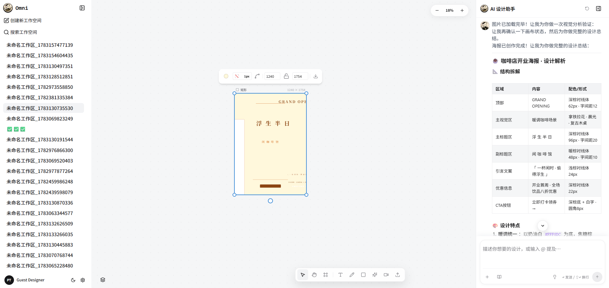
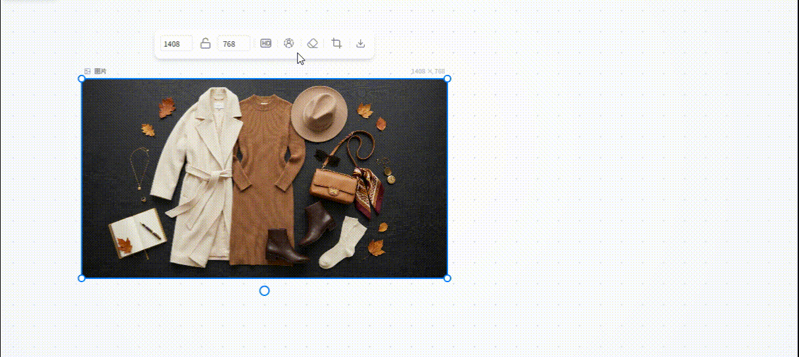
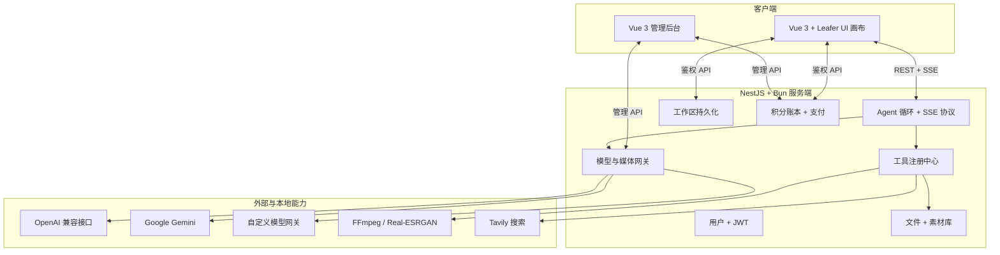

<div align="center">

# OmniCanvas

### 面向空间化、多模态创作的 AI 原生无限画布

把自然语言意图转化为可检查、可编辑的画布操作。OmniCanvas 让 Agent 理解结构化画布状态、规划设计步骤、调用工具，并直接在无限矢量画布上生成或编辑视觉内容。

[English](README.md) · [功能特性](#功能特性) · [系统架构](#系统架构) · [快速开始](#快速开始) · [参与贡献](#参与贡献)

[](LICENSE)
[](https://github.com/ye971829766/OmniCanvas/stargazers)
[](https://github.com/ye971829766/OmniCanvas/forks)
[](https://github.com/ye971829766/OmniCanvas/commits/master)
[](https://vuejs.org/)
[](https://www.typescriptlang.org/)

<br />



<br />



</div>

---

## 为什么开发 OmniCanvas？

许多 AI 创作工具把模型隐藏在输入框后，最终只返回一张扁平化结果。OmniCanvas 探索的是另一条开放路线：画布始终是人和 Agent 都能读取、理解和修改的结构化工作空间。

这个仓库不仅提供一款应用，也希望成为以下方向的全栈开放参考：

- 对结构化场景或画布状态进行推理的空间 Agent；
- 以可审计工具调用替代不透明的一次性生成；
- 结果始终可编辑的人机协同视觉工作流；
- 多语言模型、图片模型和视频模型的统一编排；
- 面向 AI 操作的可靠计量、幂等保护和失败恢复。

OmniCanvas 采用 MIT 许可证并保持活跃维护。目前它仍是早期项目，而不是稳定生产版本，API 和数据模型仍可能变化。欢迎提交 Issue、参与设计讨论或发起边界清晰的 Pull Request。

## 功能特性

### 无限矢量画布

- 基于 [Leafer UI](https://www.leaferjs.com/) 的高性能缩放和平移
- Frame、文本、画笔、图形、上传、分组、图层、吸附和对齐
- TipTap 富文本、KaTeX 数学公式、Minimap、撤销/重做和导出
- Agent 生成结果以可编辑画布节点呈现，而不只是一张渲染图片

### 画布感知 Agent

- 序列化实时画布状态，使 Agent 能查询和修改已有节点
- 通过 SSE 流式传输执行状态、工具调用、画布操作、用量和最终回复
- 支持多步设计规划、备选方案、设计分析和结果验证
- 可将选中的画布元素作为视觉参考，同时保留空间上下文
- 提供离线 Mock 模式，贡献者无需付费 API 凭据也能参与开发

### 多模态生成与编辑

- 支持可配置模型和提供商的图片、视频生成节点
- 支持指令编辑、局部重绘、去背景和超分放大
- 支持 OpenAI 兼容接口、Google Gemini、自定义网关和本地处理方案
- 素材库支持文件夹、筛选、排序和防碰撞放置

### 完整的全栈维护面

- 工作区、画布状态持久化、JWT 身份验证和可选 Google OAuth
- 支持预扣、确认、释放语义与幂等保护的积分账本
- 可选 Stripe Checkout 集成，以 Webhook 作为支付到账依据
- 独立管理后台，用于管理渠道、模型、用户、计费、用量和接口诊断

## 系统架构



### 技术栈

| 领域 | 主要技术 |
| --- | --- |
| 画布 | Leafer UI 2.x、`@leafer-in/*`、`leafer-x-easy-snap` |
| 主应用 | Vue 3.5、TypeScript、Vite、PrimeVue、UnoCSS、GSAP |
| 富内容 | TipTap、KaTeX、Marked |
| 服务端 | NestJS 11、Bun、Express、RxJS、SQLite |
| AI 集成 | Vercel AI SDK、OpenAI SDK、Google Gen AI SDK |
| 媒体 | FFmpeg、Multer、可选本地 Real-ESRGAN |
| 管理后台 | Vue 3、Element Plus、Vite |

## Agent 工具体系

工具位于 `server/src/agent/tools/`，并通过注册中心统一管理，使 Agent 能力保持显式、可检查并可独立测试。

| 类别 | 工具 |
| --- | --- |
| 画布结构 | `set_frame`、`add_frame`、`add_group`、`add_text`、`add_rect`、`add_image` |
| 节点操作 | `update_node`、`remove_node`、`query_canvas`、`focus_node`、`export_node_image` |
| 布局 | `auto_layout`、`align_nodes`、`distribute_nodes` |
| 生成 | `generate_image`、`generate_video` |
| 图像处理 | `edit_image`、`remove_background`、`inpaint_image`、`upscale_image` |
| 风格与调研 | `set_brand`、`apply_palette`、`collect_inspiration` |
| 规划与审查 | `plan_design`、`review_and_adjust`、`analyze_design`、`verify_design` |
| 联网 | `web_search`、`web_extract` |

协议细节和集成示例参见 [Agent 集成指南](agent-integration/AGENT-README.md)。

## 仓库结构

```text
OmniCanvas/
├── src/                    # 主画布应用与 Agent UI
├── server/                 # NestJS API、Agent 运行时、工具、AI 网关、计费
├── admin/                  # 渠道、模型、用户、计费和诊断后台
├── agent-integration/      # Agent 协议文档与示例
├── public/                 # 公共图片和静态资源
├── CONTRIBUTING.md         # 贡献流程与编码约定
├── BILLING_SYSTEM_DESIGN.md
└── run-all.js              # 同时启动主应用、服务端和管理后台
```

## 快速开始

### 环境要求

- Node.js 18 或更高版本
- 服务端需要 Bun 1.0 或更高版本

### 安装依赖

```bash
git clone https://github.com/ye971829766/OmniCanvas.git
cd OmniCanvas

npm install
cd server && bun install && cd ..
cd admin && npm install && cd ..
```

### 配置环境

```bash
cp .env.example .env
cd server && cp .env.example .env && cd ..
```

服务端最小配置：

```env
PORT=3000
CORS_ORIGIN=http://localhost:5173
JWT_SECRET=replace-with-at-least-32-random-bytes

OPENAI_API_KEY=your-api-key
OPENAI_BASE_URL=https://api.openai.com/v1
```

其他模型渠道、Google OAuth、Stripe、联网搜索和图像处理服务都是可选项。完整变量列表参见 `server/.env.example`。

> [!IMPORTANT]
> 请勿提交真实 API Key 或生产环境密钥。使用本地 `.env` 文件保存凭据；如果凭据可能已经泄露，请立即轮换。

### 启动全部应用

```bash
npm run dev:all
```

| 服务 | 默认地址 |
| --- | --- |
| 主画布 | <http://localhost:5173> |
| 管理后台 | <http://localhost:5174> |
| API 与 Agent 服务 | <http://localhost:3000> |

### 不使用 API 额度运行

如需在没有外部 API 权限的情况下体验 UI 或参与大部分前端开发，可启用服务端 Mock 模式：

```env
MOCK_AGENT=true
MOCK_IMAGE_GENERATION=true
MOCK_VIDEO=true
```

## 开发与验证

```bash
# 主应用测试
npm test

# 主应用类型检查与生产构建
npm run build

# 服务端测试与类型检查
cd server
bun test
bun run typecheck

# 管理后台生产构建
cd ../admin
npm run build
```

修改 Agent 行为时，应优先测试工具输入、协议事件、幂等性和失败状态，而不是只验证最终自然语言回复。

## 安全与信任边界

OmniCanvas 涉及多类安全敏感面：用户身份验证、文件上传、第三方模型渠道、流式工具执行、支付 Webhook 和本地媒体处理。所有外部响应、上传文件、Webhook 负载和模型生成的工具参数都应视为不可信输入。

当前防护包括 Schema 验证、JWT 路由保护、计费幂等键、预扣/确认/释放账务流程、Webhook 验签、可配置 CORS 和用于隔离开发的 Mock 渠道。在正式安全策略建立前，如需报告漏洞，请通过维护者 GitHub 主页私下联系，且不要公开凭据或可被利用的用户数据。

## 路线图

- [x] 支持可编辑图层和导出的无限矢量画布
- [x] 支持流式工具调用的画布感知 Agent
- [x] 图片/视频生成与图像编辑管线
- [x] 工作区、用户鉴权、积分账本和管理后台
- [ ] 多用户实时协同编辑
- [ ] 面向设计、布局和审查角色的多 Agent 编排
- [ ] 面向 Vue、React 和原子化 CSS 的画布到代码导出
- [ ] 开放插件与自定义 Agent 工具 SDK
- [ ] 版本化发布与兼容性承诺

路线图表达项目方向，不代表确定的交付日期。开始大型改动前请先提交 Issue，以便尽早讨论设计方案。

## 参与贡献

欢迎参与贡献。错误报告、可复现测试、文档改进、设计讨论和边界清晰的 Pull Request 都很有价值。

1. 阅读 [CONTRIBUTING.md](CONTRIBUTING.md)。
2. 新建问题前先搜索 [已有 Issues](https://github.com/ye971829766/OmniCanvas/issues)。
3. 对于较大的改动，请先提交 Issue 讨论实现方案。
4. 保持 Pull Request 目标集中，并按需补充测试或文档。

项目采用 Conventional Commits 和 Contributor Covenant。维护者审查会优先关注正确性、用户安全、工具行为的可理解性和长期可维护性。

## 开源协议

OmniCanvas 使用 [MIT License](LICENSE) 发布。

## 致谢

OmniCanvas 建立在 Leafer UI、Vue、NestJS、Bun、TipTap、Vercel AI SDK 等开源社区的工作之上。感谢这些项目的维护者和贡献者。
